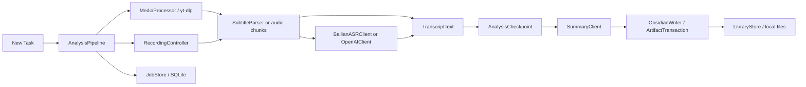

# MVS Engineering and Security Audit

Date: 2026-09-05. Baseline: commit `5a25328`, version 0.4.0 (7).
Result: version 0.4.1 (8), native Apple Silicon macOS application.

## Requirements Recovered From This Conversation

The later decisions in the conversation supersede the initial Obsidian-only plan.

| Requirement | Current implementation |
| --- | --- |
| Public video URLs, local files, manual meetings | Native SwiftUI app; yt-dlp; ScreenCaptureKit |
| Mac only, M-series chips | macOS 15+, ARM64 release |
| Alibaba Bailian transcription, DeepSeek summary | Separate stages and credentials; OpenAI/Qwen remain optional |
| Traditional Chinese to Simplified; English preserved | Transcript conversion before summary and note generation |
| Self-contained local library | User data in Application Support/MVS/Library, outside the app bundle |
| Source-based storage | URL, Local, Meeting notes and matching assets subdirectories |
| Do not keep URL video by default | Subtitle-only or audio-only processing; original URL remains in note |
| Library rename, folders and delete | Stable IDs; nested note folders; recoverable Trash operations |
| Jobs history, retry, cancel | SQLite history; cancellation waits for cleanup; summary-stage checkpoints |
| In-app note reading | Native Markdown block rendering; note/transcript/outline/mindmap/metadata tabs |
| Capture screen/window and computer audio | ScreenCaptureKit; optional microphone; no automatic meeting detection |
| Reusable app and DMG | Local release scripts; external Python/ffmpeg/Deno still required |
| Existing visual identity | Existing icon and Mitya-derived SwiftUI colors retained |

## Architecture



The historical `ObsidianWriter` name remains internal. It writes the configured
MVS library; it does not require or invoke Obsidian.

Reviewed all application Swift sources, SwiftPM configuration, Python ASR helper,
build/install/notarization scripts, existing tests, and the relevant conversation
and project context. Inspected current installed-app behavior and public dependency
advisories. No user meeting was re-transcribed or uploaded during this audit.

## Security and Data-Safety Fixes

| Before | Change | Evidence |
| --- | --- | --- |
| Project files selected by `stem.*` | Exact generated artifact suffix list | Prefix-neighbor move regression |
| YAML regex searched the whole note and mishandled escapes | Header-bound parser; JSON-quoted YAML scalar encoding | Body-spoofing, quotes, backslashes, CRLF tests |
| Rename/move could follow links out of library | Canonical containment checks and symlink rejection | Outside-note/symlink regression |
| Job file lists could include directories or internal database files | Restrict deletion to regular files in source note/media trees; refuse library roots | Containment and preflight tests |
| Partial artifact writes or failures could leave inconsistent output | Stage files, write main note last, restore previous files on failure; retain recovery data if rollback fails | Transaction rollback regression |
| Unbounded subprocess output and unreliable post-exec process groups | Spawn process group before exec; bounded capture; concurrent pipe draining; timeouts; cancellation kills descendants | Large output, Unicode split, timeout, grandchild cancellation, early-stdin-close tests |
| Raw subprocess/API errors could persist credentials | Redact common API-key, bearer, proxy-credential and signed-query patterns | Diagnostic redaction test |
| API response caching and cross-origin redirects used defaults | Ephemeral no-cookie/no-disk-cache session; same-origin HTTPS redirects only | Source inspection; no live API calls |
| Local ffmpeg probing could accept playlist/network demuxers | Local protocol and media-container allowlists | Generated MP4/AAC audio extraction test |
| Startup automatic legacy audio deletion inferred ownership from filenames | Removed automatic legacy asset deletion; current task files use private temporary folders | Source inspection; actual temp directory scan |
| Stale temp cleanup could affect another active app process | Owner PID marker; only stale workspaces with a non-live owner are eligible | Source inspection |
| Python could import user/site/current-directory modules | Version-specific interpreter; no user site, unsafe path or bytecode writes | Packaged import/launcher smoke checks |
| Failed Keychain decode/clear could lose stored credential state | Fail on malformed data; preserve caches on save failure; update existing item before adding | Source inspection |

These changes reduce concrete attack and data-loss surfaces. They are not a
claim that the application or its native media parsers are vulnerability-free.

## Correctness and Reliability Fixes

- VTT end times were parsed from an untrimmed string, producing missing end
  timestamps. SRT CRLF and JSON3 are now supported by the shared parser.
- Subtitle selection requests one ranked language rather than many translated
  tracks. Coverage checks consider the beginning, end and covered intervals;
  a single cue near the end is not accepted as a complete transcript.
- Bailian millisecond values are always divided by 1000, including 0, 500 and
  1000. Empty/error response JSON cannot become transcript content.
- OpenAI diarization includes the required chunking strategy and offsets each
  chunk's timestamps. Speaker labels are scoped per chunk rather than assuming
  the same local speaker label means the same person across requests.
- Long summary input includes available timestamps and has a hard character
  bound even for a single oversized segment. Partial segment lists cannot silently
  discard the rest of the original transcript. Reduction repeats if necessary.
- Runtime summary generation requires a complete schema-shaped response. Chat
  completion output gets one repair attempt instead of accepting a truncated
  response as successful output.
- A complete transcript is saved to `.mvs/checkpoints/<job-id>.json` before
  summary. Retry can resume there without repeating download/ASR. Original URL
  options and local input paths are persisted.
- Cancellation remains an active cleanup operation until the task detaches.
  History erasure and destructive file operations cannot race with cleanup.
- Reconfiguring a second window does not overwrite active jobs with
  "interrupted" records. SQLite uses WAL and a busy timeout; progress-only
  writes are throttled and main save failures are visible.
- Newly generated artifact names include a digest to prevent truncation/Unicode
  collisions. Existing renamed/foldered projects are reused on regeneration.
  Moving a project updates its Markdown video link as well as metadata.
- Recording start/stop operations are serialized. Callbacks from obsolete streams
  are ignored. Failed or timed-out finalization does not submit a broken MP4.
- Markdown headings, paragraphs and list items now render as separate native
  blocks. Chinese keywords retain their characters instead of becoming untitled.

## Observed Startup Defect

Launching the installed 0.4.0 app during QA hung before showing a usable window.
A one-second stack sample showed:

```text
SettingsStore.init
  -> loadUnifiedCredentialStoreIfNeeded
  -> KeychainService.loadCredentialStore
  -> SecItemCopyMatching
  -> SecurityServer decrypt / mach_msg
```

Credentials now load in a shared background task after the main view is created.
Saving and legacy reads are also moved off the main thread. A regression checks
deferred/shared loading. The installed 0.4.1 main window and Library were then
successfully opened and inspected. OS authorization can still be necessary after
an ad-hoc signed build is replaced; the app does not bypass Keychain or TCC.

## Performance and Storage

- Audio is decoded directly into <=600-second 16 kHz mono WAV chunks in one
  ffmpeg pass. The former full WAV plus copied chunks no longer coexist.
- Library scans read at most 64 KiB of each note header instead of loading every
  full transcript and rewriting legacy references on each refresh.
- Subprocess stdout is bounded at 32 MiB; stderr retains a 256 KiB tail.
- Release packaging strips executable debug symbols and removes Intel slices
  from universal native modules, retaining ARM64.
- App allocated size measured by `du -sk`: 86,780 KiB before, 82,076 KiB after,
  about 5.4% smaller. The new DMG is approximately 46.4 MiB.
- Startup scan found no existing `mvs-url-*` or `mvs-audio-*` workspaces in the
  current temporary directory. Existing user media/history were preserved.
- The build cache and older distribution copies are distinct from task temp
  files. They were measured but not indiscriminately purged.

## Release and Verification

- 44 Swift tests passed, including an actual local ffmpeg extraction from a
  generated MP4/AAC source; no cloud model usage was required.
- 4 Python ASR result-adapter tests passed.
- `pip-audit 2.10.1` checked 49 unique bundled Python distributions: no known
  vulnerabilities, no skipped packages. Raw result: `dependency-audit-2026-09-05.json`.
- A targeted Git-history search found no `sk-`-style long key literals in
  Sources, scripts or config. This is a bounded pattern check, not a guarantee
  about every possible credential format.
- Release build, bundled ASR imports, bundled yt-dlp launcher, installed-app
  signature, app startup and native Library/Markdown UI were checked.
- Fixed missing SwiftPM resource packaging and removed the installed app's
  runtime dependency on the original source-tree resource bundle.
- Dependency versions are constrained in `config/runtime-constraints.txt`;
  the native-wheel Python minor version is declared in `config/python-version`.
- Dependency setup and app installation prepare/verify replacements before
  replacing the prior installation. Notarization now staples the app as well
  as the final DMG when credentials are available.

## Remaining Limits and Follow-up Work

1. No valid Developer ID identity is installed. This build remains ad-hoc signed;
   real signing, Apple notarization and a clean-machine Gatekeeper test were not run.
2. Python 3.14, ffmpeg and Deno are external prerequisites. A fully self-contained
   offline installer would need licensed/versioned bundled runtimes and a larger
   distribution. Native/Homebrew dependency CVEs are outside the 49-package audit.
3. Checkpoint recovery starts after the complete transcript is available.
   Per-ASR-chunk and per-summary-map checkpointing, plus byte-level download resume,
   remain separate improvements.
4. Platform support still depends on yt-dlp extractors. No new live 429/403,
   authenticated video, 30/60-minute cloud ASR, or real conference recording run
   was performed in this audit.
5. Subtitle coverage is a heuristic; long genuine silences can trigger ASR.
   Original subtitle files and the entire raw platform metadata response are not
   yet retained as separately browsable artifacts.
6. Search currently filters titles, sources and folders. Full-content local
   indexing/semantic retrieval and dedicated podcast platform adapters remain
   roadmap items rather than implemented features.
7. Plain transcription models may not supply sentence timestamps. Such SRT
   output should not be treated as precisely aligned captions.
8. File updates roll back ordinary I/O failures; abrupt power loss during a
   multi-file move/write still needs a durable filesystem-operation journal.
9. A credential was previously pasted into this conversation. Rotate it in the
   provider console if that has not already been done, then update it in MVS.

## Primary References

- [OpenAI file transcription](https://developers.openai.com/api/docs/guides/speech-to-text):
  diarization parameters and response handling.
- [Alibaba Paraformer Python SDK](https://help.aliyun.com/zh/model-studio/paraformer-real-time-speech-recognition-python-sdk):
  millisecond timestamps and non-streaming sentence lists.
- [yt-dlp security advisories](https://github.com/yt-dlp/yt-dlp/security/advisories):
  downloader attack surfaces and published advisories.
